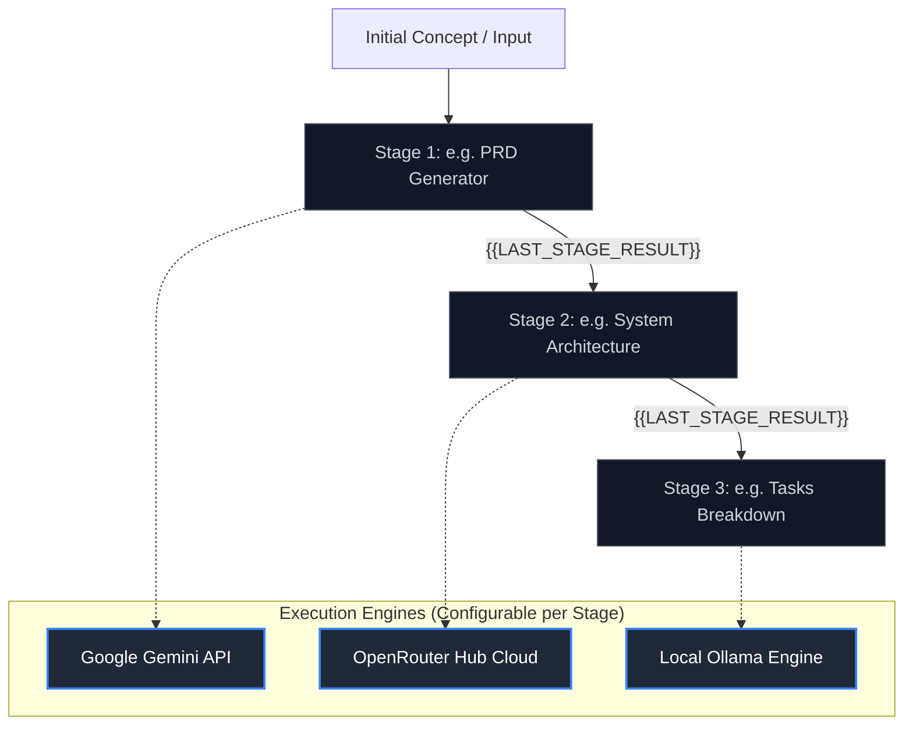

# LLM Chain Reaction 🧪🔗

An orchestration dashboard for multi-stage language model prompt chains. Run, experiment, and link prompts sequentially using Google Gemini, OpenRouter, and local Ollama.

---

## 📖 Overview

**LLM Chain Reaction** is a developer-focused playground and orchestration interface designed to build, run, and optimize multi-stage LLM pipelines. Instead of running prompts in isolation, LLM Chain Reaction allows you to feed the output of one stage directly into the next, establishing a semantic "handshake" across consecutive reasoning steps.

Whether you are converting a product concept into a full system architecture and task list, or synthesizing raw research notes into a polished blog post with social media hooks, this application provides the visual workflow, version control, and engine flexibility to make multi-stage prompting reliable and transparent.



---

## ✨ Core Features

### 1. Sequential Prompt Chaining
* **Token-based Injection**: Embed the `{{LAST_STAGE_RESULT}}` placeholder in any stage prompt to inject the exact output of the preceding stage.
* **Implicit Context Injection**: If no token is provided, the system automatically wraps the prompt, prepending the previous output as context under structural headers.
* **Granular Execution**: Execute the entire prompt chain from start to finish, or run individual stages independently.

### 2. Multi-Engine Routing
* **Google Gemini API**: Full integration with the official `@google/genai` SDK for streaming responses with system instructions, temperature controls, and Top-P tuning.
* **OpenRouter Cloud Hub**: Access hundreds of open-source and proprietary models (such as DeepSeek R1, Llama 3.3, Claude, and GPT-4o) using a unified proxy interface.
* **Ollama Local Integration**: Run fully local, private prompt chains directly against your localhost Ollama server (`http://localhost:11434`).

### 3. Real-Time Dynamic Model Selection
* **Dynamic Catalogs**: No hardcoded model lists. The application queries the Gemini API (via the `@google/genai` SDK) and the OpenRouter API in real time.
* **Smart Filtering**: Automatically filters out embedding, multimodal, and image-generation models to present only text-generation models.
* **Robust Fallbacks**: If API keys are missing or network errors occur, the backend gracefully falls back to static lists of popular models, ensuring the user interface remains functional.

### 4. Interactive Development Tools
* **Version History & Pinned Outputs**: Maintain multiple runs for each stage. Switch between historical versions and pin a specific output to lock the context for downstream stages.
* **Visual Diff Viewer**: View line-by-line and word-by-line highlighted diffs between different execution outputs or history versions.
* **Prompt Previewer**: Check exactly how the prompt template will compile with the injected context before spending tokens on an API execution.
* **Stage Management**: Add, delete, or drag and drop stages to reorder the prompt pipeline.
* **Consolidated Reports**: View or export a beautifully compiled markdown report containing the complete prompt and output history of the entire chain.
* **Import & Export**: Save entire chain configurations to local JSON files and reload them later.

---

## 🛠️ Tech Stack & Architecture

* **Frontend**: React 19, Vite 6, Tailwind CSS, Motion (Framer Motion) for micro-animations, and Lucide React for icons.
* **Backend**: Express server running on Node.js, compiling TypeScript dynamically via `tsx`.
* **API Clients**: Official `@google/genai` SDK for Google Gemini integrations, and standard Fetch API for OpenRouter and local Ollama integrations.

---

## 🚀 Getting Started

### Prerequisites
* **Node.js** (v18 or higher recommended)
* **npm** or another package manager

### Installation

1. Clone the repository and navigate to the project root:
   ```bash
   git clone <repository-url>
   cd LLM-Chain-Reaction-
   ```

2. Install dependencies:
   ```bash
   npm install
   ```

3. Configure your environment variables:
   * Create a `.env` file in the root directory.
   * Add your Gemini API key (from Google AI Studio):
     ```env
     GEMINI_API_KEY="your_gemini_api_key_here"
     ```
   * *(Optional)* Add a default OpenRouter API key:
     ```env
     OPENROUTER_API_KEY="your_openrouter_api_key_here"
     ```

### Running the Application

Start the development server (which launches the Express backend and the Vite frontend proxy):
```bash
npm run dev
```

The application will be online at: **`http://localhost:3000`**

---

## 📖 How to Use

### 1. Setting Up Your API Keys
* **System Keys**: Set your API keys in the `.env` file to make them available globally.
* **Custom User Keys**: If you are deploying the application or running without server keys, click the **Settings** gear icon in the sidebar. You can input custom Gemini and OpenRouter API keys directly in the sidebar; they are stored securely in your browser's local storage.

### 2. Creating or Loading a Chain
* **Preset Templates**: Use one of the three preloaded templates in the sidebar to get started:
  1. *PRD ➔ Outline ➔ Tasks* (Product management workflow)
  2. *Research ➔ Blog Draft ➔ Hooks* (Content creation workflow)
  3. *Code Architect ➔ Refactor ➔ Tests* (Software engineering workflow)
* **Custom Chains**: Click **New Chain** in the sidebar to build a pipeline from scratch.

### 3. Writing Prompt Templates
To chain stages, write your prompts and reference the previous output:
* **Explicit Chaining**: Use the `{{LAST_STAGE_RESULT}}` token:
  ```text
  Review the following system architecture design and generate a list of unit tests:
  
  {{LAST_STAGE_RESULT}}
  ```
* **Implicit Chaining**: If you do not include the token, the backend automatically structures the prompt by injecting the upstream output at the top of your prompt under a `[Previous Output]` block.

### 4. Selecting Models
* **Global Model**: Select a base model from the sidebar. It will be used for all stages by default.
* **Stage Overrides**: Expand a stage card, click the settings row, and select a specific model override for that stage. This allows you to mix and match models (e.g., using a fast model like Gemini 2.5 Flash for drafts, and a reasoning model like DeepSeek R1 via OpenRouter for architecture).

### 5. Running the Pipeline
* **Run Step**: Click the **Run Step** button on an individual stage card to execute only that stage.
* **Sequential Run**: Click **Run Sequential Chain** in the header to run all stages in sequence. The system will wait for each stage to complete, feed its output into the next stage, and continue until the final stage is complete.

### 6. Versioning and Comparing Outputs
* When you run a stage multiple times, each output is saved in its **History Gallery**.
* Click **History** on a stage card to view past versions.
* Click **Pin Version** to make a specific historical run the active context for downstream stages.
* Click **View Diff** to visually compare the current output with a previous version.

---

## 🐳 Local Ollama Connectivity

To use local models:
1. Ensure your local Ollama server is running (usually at `http://localhost:11434`).
2. Pull the models you want to use (e.g., `ollama pull llama3` or `ollama pull deepseek-r1`).
3. Set the **Primary Engine Provider** to `Ollama` in the sidebar.
4. The app will automatically scan and list your locally installed Ollama models.
5. Select your local model and run your prompt stages fully offline.

---

## 📝 License

This project is licensed under the MIT License. See the [LICENSE](LICENSE) file for details.
